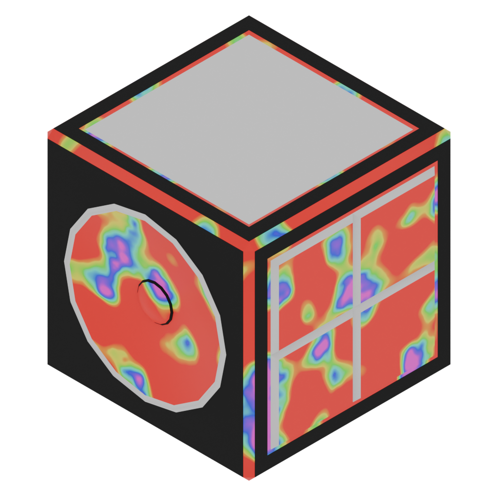

# SoundBox
A soundboard made with nodejs.

## Building
`npm install`

`npm run dist`

The app will only build for the os running the build command, not all platforms.

## Adding Sounds

### Windows
Open explorer and go to `%appdata%/SoundBox/sounds`

### Mac
Open Finder and use the Go To command to go to 
`~/Library/Application Support/SoundBox/`
